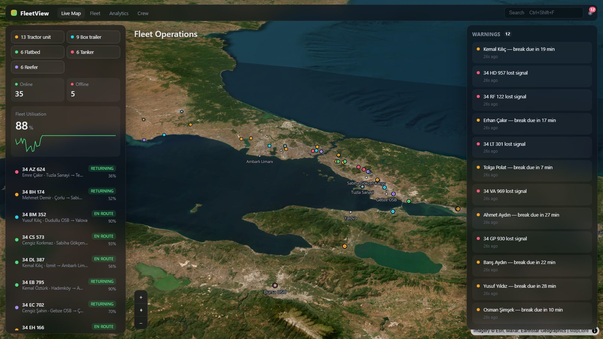
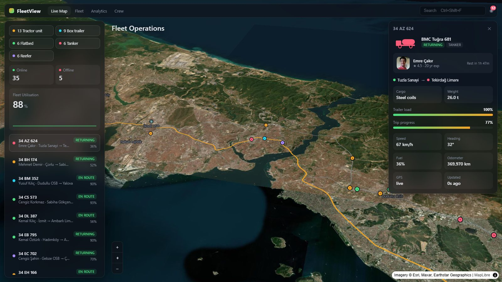
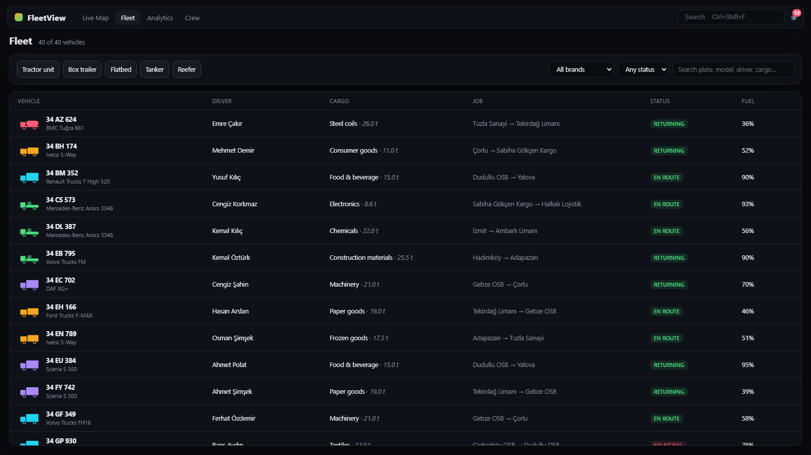
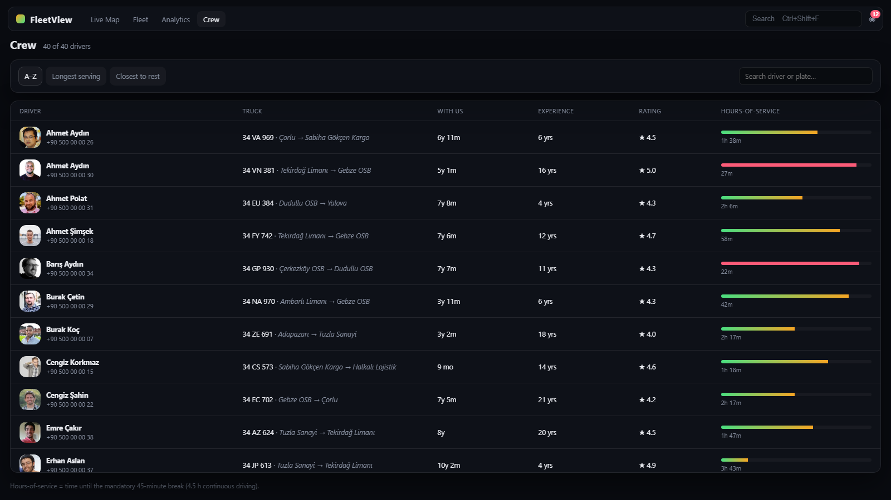

# FleetView

Mock dashboard for a road-freight fleet operating out of İstanbul. A 3D-tilted map
of the Marmara region with ~40 simulated trucks running real road-following delivery
jobs. Click a truck for its driver, cargo, and telemetry.

Everything is faked in the browser — no backend, no network calls except map tiles.

| | |
|---|---|
|  |  |
|  |  |

## Run

```bash
npm install
npm run dev        # http://localhost:5173
```

### Map tiles

Runs keyless on a dark [Carto](https://carto.com/) basemap. For satellite imagery +
raster-DEM terrain, add a free [MapTiler](https://cloud.maptiler.com/account/keys/) key:

```bash
cp .env.example .env      # set VITE_MAPTILER_KEY=...
```

## Views

- **Live Map** — trucks on the map (colour = trailer class), left rail with class
  filters / utilisation / list, right rail with the warnings feed or a selected
  truck's detail.
- **Fleet** — every vehicle in a filterable table (class, brand, status, search):
  plate, brand/model, driver, cargo + weight, job, fuel.
- **Analytics** — mock financials (weekly revenue, gross margin, cost/km, profit per
  delivery, outstanding invoices) plus operations KPIs and charts (revenue vs cost,
  deliveries/day, cargo mix).
- **Crew** — driver table (photos from [randomuser.me](https://randomuser.me), initials
  fallback): assigned truck + job, tenure, experience, safety rating, and a
  hours-of-service bar (time until the next mandatory break). Row → that truck on the map.

## Scripts

| Command | What |
|---|---|
| `npm run dev` | dev server |
| `npm run build` | type-check + production build |
| `npm test` | `src/geo.test.ts` — polyline + right-offset math |
| `npm run lint` | oxlint |
| `node scripts/build-jobs.mjs` | regenerate `src/jobs.json` from the OSRM demo server |

## How it works

- **`src/jobs.json`** — 14 freight legs across the Marmara region (İstanbul ports and
  OSBs ↔ İzmit, Adapazarı, Tekirdağ, Bursa, …), road-snapped once from OSRM so there
  is no routing API at runtime.
- **`src/mock.ts`** — seeded fleet: ~40 trucks (real TR-market brands) + drivers.
- **`src/sim.ts`** — each frame a truck advances along its job path (outbound →
  unload → return → next job), drifts fuel, and clocks the driver's driving time
  toward the 4.5 h break limit. Positions are offset ~9 m right of the centreline
  for right-hand traffic.
- **`src/useSimulation.ts`** — rAF loop pushes positions to the map source; a 2 Hz
  interval snapshots into the store for the panels.
- **`src/store.ts`** — Zustand: view, trucks, drivers, selection, filters, alerts.
- **`src/FleetMap.tsx`** — MapLibre via react-map-gl; job/endpoint/truck layers built
  imperatively on load.

## Not included (deliberately)

Backend, auth, live routing engine (jobs are pre-baked), charting library, 3D
building extrusions. See `PLAN.md`.
