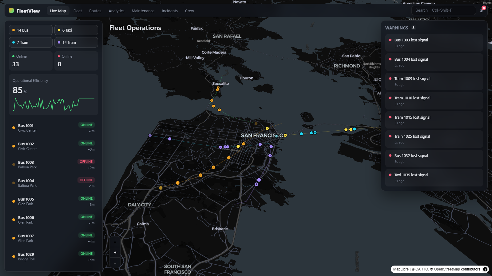

# FleetView

Mock fleet-management dashboard. A 3D-tilted map of San Francisco with ~40
simulated vehicles moving along routes in real time. Click a vehicle (on the map
or in the list) to see its status, route, stops, and telemetry.

Everything is faked in the browser — no backend, no network calls except map tiles.



## Run

```bash
npm install
npm run dev        # http://localhost:5173
```

### Map tiles

Runs keyless out of the box on a dark [Carto](https://carto.com/) basemap (with
hillshade). For satellite imagery + raster-DEM terrain, add a free
[MapTiler](https://cloud.maptiler.com/account/keys/) key:

```bash
cp .env.example .env
# then set VITE_MAPTILER_KEY=...
```

## Scripts

| Command | What |
|---|---|
| `npm run dev` | dev server |
| `npm run build` | type-check + production build |
| `npm test` | `src/geo.test.ts` — polyline math self-check |
| `npm run lint` | oxlint |

## How it works

- **`src/mock.ts`** — 5 hand-drawn routes + ~40 seeded vehicles.
- **`src/sim.ts`** — mutates vehicle positions each frame (bounce along the
  polyline, drift passenger load / schedule offset, rare signal drops).
- **`src/useSimulation.ts`** — rAF loop pushes positions straight to the map
  source; a 2 Hz interval snapshots into the store for the panels.
- **`src/store.ts`** — Zustand: vehicles, selection, type filters, derived alerts.
- **`src/FleetMap.tsx`** — MapLibre via react-map-gl. Route/stop/vehicle layers
  are built imperatively on load; selection and filters drive `setFilter`.
- **`src/panels/`** — top bar, left rail (filters, counts, efficiency sparkline,
  vehicle list), right rail (warnings feed / vehicle detail).

## Not included (deliberately)

Backend, auth, real routing engine, multi-page nav (top-bar tabs are visual),
charting library, 3D building extrusions, bottom stat strips. See `PLAN.md`.
